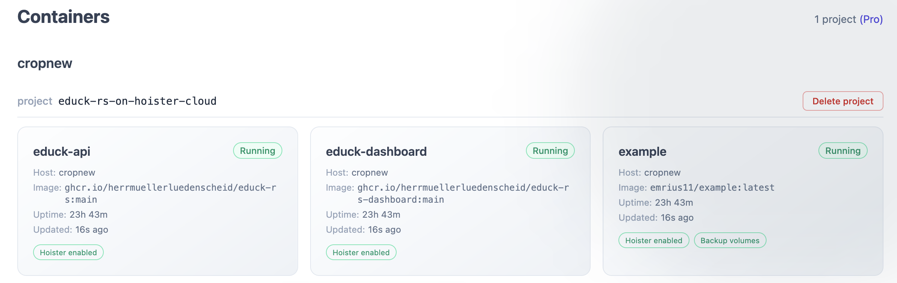
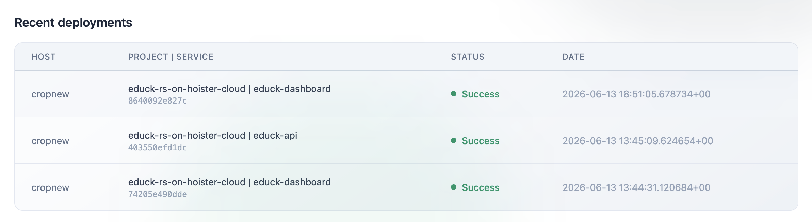

The Hoister container is stateless and does not store any info about updates. But it can forward the update events to the
hoister controller service. The dashboard is a frontend for this service to keep track of all monitored services and updates.



Every rollout the agents report shows up in the **Recent deployments** feed, grouped by host and service, with the
image digest and whether the update succeeded, failed or was rolled back.



The example below runs the whole stack on a single host: the agent, the controller and the dashboard, plus an `app`
service to watch. Point the agent at the local controller with `HOISTER_CONTROLLER_URL` so it reports there instead of
the hosted cloud.

```yaml title="docker-compose.yml"
services:

  app:
    image: nginx:latest
    labels:
      - "hoister.enable=true"  # let Hoister manage this service

  hoister:
    image: hoister/hoister:latest
    volumes:
      - /var/run/docker.sock:/var/run/docker.sock
    security_opt:
      - no-new-privileges:true
    environment:
      HOISTER_CONTROLLER_URL: "http://hoister-controller:3033"  # report to the local controller
      HOISTER_HOSTNAME: my-host  # without this the agent reports the hostname as "undefined"
    labels:
      - "hoister.hide=true"  # keep Hoister's own containers out of the dashboard

  hoister-controller:
    image: hoister/hoister-controller:latest
    volumes:
      - controller-data:/data  # to persist deployments across restarts
    labels:
      - "hoister.hide=true"

  hoister-frontend:
    image: hoister/hoister-frontend:latest
    ports:
      - "3000:3000"
    environment:
      HOISTER_CONTROLLER_URL: "http://hoister-controller:3033"
      HOISTER_AUTH_USERNAME: admin
      HOISTER_AUTH_PASSWORD: $$2b$$05$$9cQr6ip8PmR0dUN3..NR0.UazKLunYc/RrjpzI8GrGg5eSvsqbbiC  # password
    labels:
      - "hoister.hide=true"

volumes:
  controller-data:
```

Open the dashboard at [http://localhost:3000](http://localhost:3000) and sign in with the username and password above.

You can set a clear text password in the environment variable `HOISTER_AUTH_PASSWORD` but a better way is to use a
hashed password. When you put a bcrypt hash directly in a Compose file, double every `$` to `$$` (as above) — otherwise
Docker Compose treats `$...` as a variable reference and corrupts the hash.
