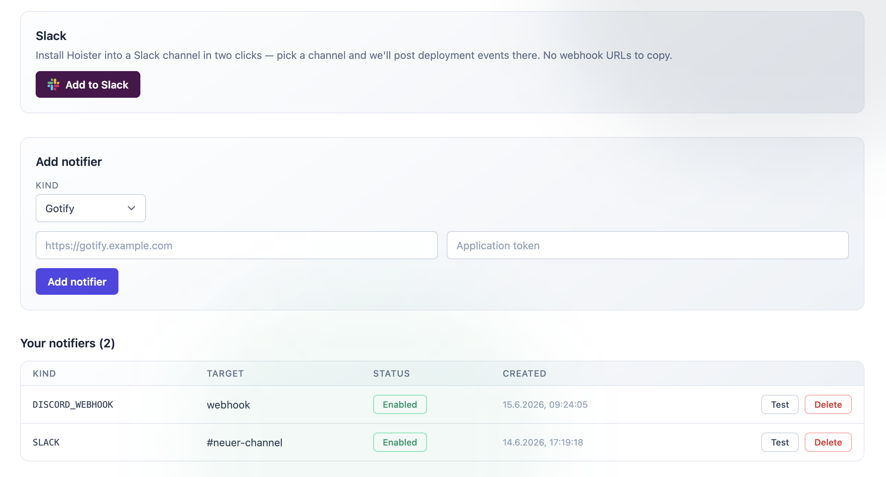

Hoister can notify you of successful, failed and rolled back updates through a
range of channels:

- **Chat:** Slack, Telegram, Discord (bot or webhook), Microsoft Teams,
  Mattermost, Rocket.Chat, Google Chat, Matrix
- **Push:** Gotify, ntfy, Pushover
- **Other:** Email (SMTP) and a generic JSON webhook

You can configure as many channels as you like — every configured dispatcher
receives every event.

When using the [cloud dashboard](/guides/frontend/), notifiers can be added and
tested directly from the **Notifiers** page — including a two-click Slack install.



## Configuring dispatchers

Notifiers are configured under `[dispatcher.*]` tables in your `hoister.toml`.
For example, to post to a Telegram chat and a Mattermost channel:

```toml title="hoister.toml"
[dispatcher.telegram]
token="123456789:qwertyuiopasdfghjkl"
chat=123456789

[dispatcher.mattermost]
webhook="https://mattermost.example.com/hooks/xxxxxxxxxxxxxxxxxxxxxxxxxx"
```

The exact fields for every channel are listed in the
[TOML configuration reference](/reference/toml/). Mount the file into the agent
container as described there.
